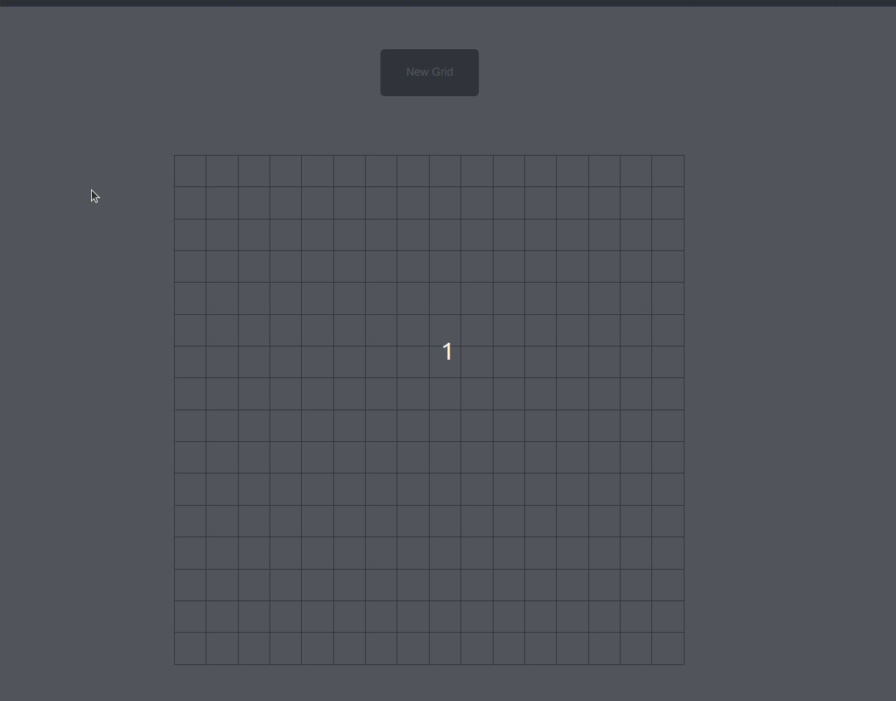

# Browser Etch-A-Sketch
A twist on the classic kids toy, the Etch-A-Sketch: now for web and in fun colors!

## Acknowledgements
This project was developed for The Odin Project's [Etch-A-Sketch challenge][1]. As usual, the
internet was a big help, but I want to especially thank the TOP discord for assistance, particularly
user hbar1st. Thanks for the assistance in troubleshooting!

- Random color generation technique: https://stackoverflow.com/a/40618761

[1]: https://www.theodinproject.com/lessons/foundations-etch-a-sketch